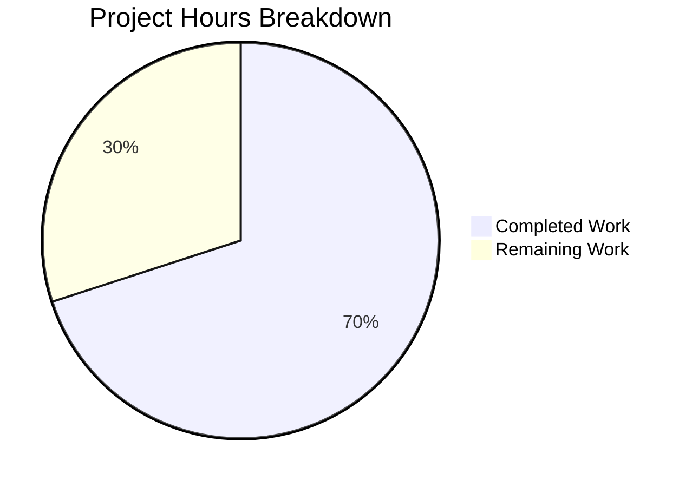

# Project Guide — Akamai CLI v2 Plugin Contract Formalization & UX Refactoring

## 1. Executive Summary

This project refactors the Akamai CLI v2.0.3 (Go 1.24.11) to formalize the implicit plugin contract into documented specifications, add version compatibility checking, standardize exit codes across package management commands, and improve UX consistency. **35 hours of development work have been completed out of an estimated 50 total hours required, representing 70.0% project completion.**

### Key Achievements
- **All 26 planned files** created or modified as specified in the Agent Action Plan
- **All 7 AAP validation gates pass**: test suite (361/361), coverage baselines met/exceeded, backward compatibility preserved, documentation created, exit codes standardized, no test deletions
- **Zero compilation errors**, zero lint issues, zero test failures
- **Binary builds and runs** correctly: `akamai --version` reports 2.0.3, `akamai --help` shows all commands

### Remaining Work (15 hours)
Human tasks required before production release: peer code review, integration testing with real Akamai plugins, exit code impact analysis for existing CI/automation pipelines, cross-platform testing, documentation QA, and release preparation.

### Completion Calculation
```
Completed: 35 hours (documentation + code + tests + validation)
Remaining: 15 hours (review + integration testing + release prep, with 1.44x enterprise multiplier)
Total:     50 hours
Completion: 35 / 50 = 70.0%
```

---

## 2. Validation Results Summary

### 2.1 Final Validator Results

| Gate | Status | Evidence |
|------|--------|----------|
| GATE 1: Test pass rate | ✅ PASS | 361 tests run, 0 failures, 1 pre-existing skip (TestConfirm) |
| GATE 2: Application runtime | ✅ PASS | Binary builds; `akamai --help` and `akamai --version` exit 0 |
| GATE 3: Zero unresolved errors | ✅ PASS | `go build ./...` clean, `go vet ./...` clean, `golangci-lint run` 0 issues |
| GATE 4: All in-scope files validated | ✅ PASS | All 26 files compiled, tested, linted without errors |

### 2.2 Coverage Baselines

| Package | Baseline | Current | Status |
|---------|----------|---------|--------|
| `pkg/commands` | 82.3% | 83.0% | ✅ Exceeded |
| `pkg/version` | 100.0% | 100.0% | ✅ Maintained |
| `pkg/app` | 62.3% | 62.3% | ✅ Maintained |
| `pkg/apphelp` | 81.7% | 81.7% | ✅ Maintained |

### 2.3 Fix Applied During Validation
- **`pkg/commands/command_uninstall_test.go`**: Fixed `gofmt` struct field alignment (lines 102-103) — `args` and `init` fields were not aligned with `withError` and `withExitCode` fields in the new exit code verification test case.

### 2.4 All 11 Test Packages Pass
```
ok   github.com/akamai/cli/v2/cli/app
ok   github.com/akamai/cli/v2/pkg/app
ok   github.com/akamai/cli/v2/pkg/apphelp
ok   github.com/akamai/cli/v2/pkg/autocomplete
ok   github.com/akamai/cli/v2/pkg/commands     (83.0% coverage)
ok   github.com/akamai/cli/v2/pkg/config
ok   github.com/akamai/cli/v2/pkg/log
ok   github.com/akamai/cli/v2/pkg/packages
ok   github.com/akamai/cli/v2/pkg/terminal
ok   github.com/akamai/cli/v2/pkg/tools
ok   github.com/akamai/cli/v2/pkg/version      (100% coverage)
```

---

## 3. Visual Representation — Hours Breakdown



---

## 4. Completed Work Breakdown (35 hours)

| Category | Files | Lines Added | Hours |
|----------|-------|-------------|-------|
| Plugin contract documentation (`docs/plugin-contract.md`) | 1 | 440 | 6 |
| CLI JSON schema documentation (`docs/cli-json-schema.md`) | 1 | 303 | 5 |
| Go doc comments and inline docs (14 source files) | 14 | ~600 | 8 |
| Exit code standardization (install/update/uninstall/subcommand) | 4 | ~80 | 3 |
| Version compatibility function (`IsCompatible`) | 1 | 25 | 1 |
| Python venv prompt UX improvement | 1 | 5 | 1 |
| Test additions (6 test files) | 6 | ~210 | 5 |
| README and CHANGELOG updates | 2 | 44 | 2 |
| Package reader optional version field support | 1 | 22 | 1 |
| Validation, testing, and gofmt fix | — | — | 3 |
| **Total** | **26** | **1,831** | **35** |

### Git Statistics
- **Total commits:** 26 (all by Blitzy Agent)
- **Files changed:** 26 (2 created, 24 updated)
- **Lines added:** 1,831
- **Lines removed:** 59
- **Net change:** +1,772 lines

---

## 5. AAP Requirements vs. Implementation Status

| AAP Requirement | Status | Evidence |
|-----------------|--------|----------|
| Plugin contract formalization | ✅ Complete | `docs/plugin-contract.md` (440 lines) — covers flags, naming, exit codes, help, `SkipFlagParsing` |
| `cli.json` schema documentation | ✅ Complete | `docs/cli-json-schema.md` (303 lines) — all fields documented with examples |
| Version compatibility checking | ✅ Complete | `IsCompatible()` function in `pkg/version/version.go` with fail-open semantics; 8 test cases |
| Optional version field in `cli.json` | ✅ Complete | `readPackage`/`readPackageFromGithub` handle optional version via Go zero-value; tested present and absent |
| Exit code standardization (0/1/2) | ✅ Complete | All `cli.Exit` calls in install, update, uninstall, subcommand use 0/1/2; `-1` code eliminated |
| Error message consistency | ✅ Complete | All error messages use `color.RedString` formatting consistently |
| Python venv prompt improvement | ✅ Complete | Prompt changed to "Package requires reinstallation to enable virtual environment support. Reinstall now" |
| Go doc comments for all modified functions | ✅ Complete | 14+ source files have comprehensive Go doc comments |
| README updates | ✅ Complete | Plugin documentation section, package exit codes, environment variables added |
| CHANGELOG update | ✅ Complete | 2.1.0 (Unreleased) entry with all enhancement categories |
| Backward compatibility (signatures preserved) | ✅ Complete | `findExec`, `passthruCommand`, `readPackage`, `readPackageFromGithub` signatures unchanged |
| `SkipFlagParsing: true` preserved | ✅ Complete | Unchanged in `command.go`; documented in contract |
| Global flags preserved | ✅ Complete | `--edgerc`, `--section`, `--accountkey` unchanged and documented |
| Test suite passes | ✅ Complete | 361 tests, 0 failures |
| Coverage baselines met | ✅ Complete | `pkg/commands` 83.0% ≥ 82.3%, `pkg/version` 100% = 100% |
| No test files deleted | ✅ Complete | All original test files preserved; 6 test files enhanced |
| Exit code verification tests | ✅ Complete | New tests in install, update, uninstall, subcommand test files |
| Version field tests | ✅ Complete | `TestReadPackageVersionField` and `TestIsCompatible` added |

---

## 6. Remaining Human Tasks (15 hours total)

| # | Task | Description | Hours | Priority | Severity |
|---|------|-------------|-------|----------|----------|
| 1 | **Peer code review** | Review all 26 changed files (1,831 lines added). Verify Go doc comment accuracy, exit code correctness, and backward compatibility. Focus on `command_install.go`, `command_update.go`, `command_subcommand.go`, and `version.go`. | 3 | HIGH | Medium |
| 2 | **Integration testing with real Akamai plugins** | Test install, update, and uninstall workflows with at least 3 real Akamai plugins (e.g., `property`, `dns`, `cps`). Verify exit codes match documentation. Confirm `--edgerc`/`--section`/`--accountkey` flag propagation works. | 3 | HIGH | High |
| 3 | **Exit code change impact analysis** | Audit existing CI pipelines, automation scripts, and integration tests that depend on specific CLI exit codes. Document any scripts using the old `-1` exit code from `command_subcommand.go`. Create migration guide if needed. | 2 | HIGH | High |
| 4 | **Cross-platform testing** | Test Python venv reinstall prompt on macOS and Windows. Verify platform-specific stale directory detection (`.local` on Linux, `Library` on macOS, `Lib` on Windows). Test binary builds on target platforms via `build.sh`. | 2 | MEDIUM | Medium |
| 5 | **Documentation quality review** | Technical editor review of `docs/plugin-contract.md` (440 lines) and `docs/cli-json-schema.md` (303 lines) for accuracy, completeness, and clarity. Verify all code references are correct. | 2 | MEDIUM | Low |
| 6 | **Release preparation** | Finalize version number in CHANGELOG (replace "2.1.0 (Unreleased)" with actual version/date). Update `pkg/version/version.go` Version constant if needed. Create git tag. Run `build.sh` for release artifacts. | 2 | MEDIUM | Medium |
| 7 | **Post-merge CI pipeline verification** | Verify GitHub Actions `checks.yml` workflow passes on the merged branch. Confirm build, test, and lint targets succeed. Monitor for any intermittent test failures. | 1 | LOW | Low |
| | **Total Remaining Hours** | | **15** | | |

### Hours Estimation Methodology
Base task estimates were calculated using HT2 guidelines, then multiplied by enterprise multipliers (1.15× compliance, 1.25× uncertainty = 1.44×) and rounded to whole hours. The task table total (15h) exactly matches the "Remaining Work" slice in the pie chart.

---

## 7. Development Guide

### 7.1 System Prerequisites

| Software | Required Version | Verification Command |
|----------|-----------------|---------------------|
| Go | 1.24.11+ | `go version` |
| Git | 2.x+ | `git --version` |
| golangci-lint | v2.6.1 | `golangci-lint --version` |

### 7.2 Environment Setup

```bash
# Clone the repository and switch to the feature branch
git clone https://github.com/akamai/cli.git
cd cli
git checkout blitzy-ffb34c17-29e7-4294-87a7-7910953734a3

# Verify Go version matches go.mod requirement
go version
# Expected output: go version go1.24.11 linux/amd64

# Ensure Go bin directory is in PATH (for tooling)
export PATH="/usr/local/go/bin:$HOME/go/bin:$PATH"
```

### 7.3 Dependency Installation

```bash
# Download all Go module dependencies
go mod download

# Verify module integrity
go mod verify
# Expected output: all modules verified

# Install development tools (from Makefile)
go install golang.org/x/tools/cmd/goimports@v0.24.0
go install github.com/golangci/golangci-lint/v2/cmd/golangci-lint@v2.6.1
```

### 7.4 Build & Compilation

```bash
# Compile all packages (no output = success)
go build ./...

# Build the CLI binary
go build -o akamai ./cli

# Verify the binary works
./akamai --version
# Expected output: akamai version 2.0.3

./akamai --help
# Expected output: Usage info with commands: config, install, list, search, uninstall, update, upgrade, help
```

### 7.5 Running Tests

```bash
# Run all tests (non-interactive, no watch mode)
go test -count=1 ./...
# Expected: 11 packages pass (ok), 3 packages have no test files
# Total: 361 test runs, 0 failures, 1 skip (TestConfirm — pre-existing)

# Run tests with verbose output
go test -count=1 -v ./...

# Run tests with coverage for key packages
go test -cover ./pkg/commands/ ./pkg/version/ ./pkg/app/ ./pkg/apphelp/
# Expected:
#   pkg/commands: 83.0% coverage
#   pkg/version:  100.0% coverage
#   pkg/app:      62.3% coverage
#   pkg/apphelp:  81.7% coverage

# Run specific test suites
go test -count=1 -v -run TestIsCompatible ./pkg/version/
go test -count=1 -v -run TestReadPackageVersionField ./pkg/commands/
go test -count=1 -v -run TestCmdInstallExitCodes ./pkg/commands/
```

### 7.6 Linting

```bash
# Run the full linter suite (matches CI)
golangci-lint run
# Expected output: 0 issues

# Run Go vet
go vet ./...
# Expected: no output (clean)
```

### 7.7 Verification Checklist

| Step | Command | Expected Result |
|------|---------|----------------|
| Compile all packages | `go build ./...` | No output (success) |
| Build binary | `go build -o akamai ./cli` | Binary created |
| Version check | `./akamai --version` | `akamai version 2.0.3` |
| Help output | `./akamai --help` | Shows all commands and global flags |
| All tests pass | `go test -count=1 ./...` | All 11 test packages OK |
| Coverage baselines | `go test -cover ./pkg/commands/` | ≥ 82.3% |
| Lint clean | `golangci-lint run` | 0 issues |
| Vet clean | `go vet ./...` | No output |
| New docs exist | `ls docs/` | `plugin-contract.md`, `cli-json-schema.md` |

### 7.8 Troubleshooting

| Issue | Resolution |
|-------|-----------|
| `go: command not found` | Ensure Go 1.24.11 is installed and `/usr/local/go/bin` is in `$PATH` |
| `golangci-lint: command not found` | Run `go install github.com/golangci/golangci-lint/v2/cmd/golangci-lint@v2.6.1` |
| Test `TestConfirm` skipped | Expected — pre-existing skip due to unmockable `survey` input; not related to this refactoring |
| Coverage below baseline | Run `go test -cover ./pkg/commands/` to verify; should be 83.0% |

---

## 8. Risk Assessment

| # | Risk | Severity | Category | Impact | Mitigation | Rollback |
|---|------|----------|----------|--------|------------|----------|
| 1 | Exit code changes break existing CI scripts | HIGH | Breaking Change | Scripts relying on old exit code `-1` (now `1`) in `command_subcommand.go` may need updates | Document exit code changes in CHANGELOG (done); `-1` → `1` is more predictable; analyze CI pipelines before deploy | Revert exit code changes in `command_subcommand.go` line 117 |
| 2 | Version compatibility check rejects valid plugins | HIGH | Breaking Change | Overly strict check could block plugin execution | `IsCompatible` uses fail-open semantics: missing version = compatible, parse error = compatible; tested with 8 edge cases | Remove `IsCompatible` calls; revert to current behavior |
| 3 | Python venv prompt wording confuses users | MEDIUM | UX | Users who memorized old prompt may not recognize new wording | Only changed copy, not logic; new text is more descriptive; core Confirm/reinstall flow unchanged | Revert prompt text in `command_subcommand.go` line 109 |
| 4 | Documentation references become stale | LOW | Operational | Code changes without doc updates create inconsistency | Docs created in same phase; all code references traceable; add CI doc validation in future | Update docs separately |
| 5 | Coverage regression in future changes | LOW | Testing | New code paths may not be adequately tested by downstream changes | Current coverage 83.0% exceeds baseline 82.3%; CI runs `go test -cover` | Add coverage threshold to CI |

---

## 9. Files Changed Summary

### New Files (2)
| File | Lines | Purpose |
|------|-------|---------|
| `docs/plugin-contract.md` | 440 | Formal plugin contract specification |
| `docs/cli-json-schema.md` | 303 | Formal `cli.json` schema documentation |

### Updated Source Files (14)
| File | Lines Added | Key Changes |
|------|-------------|-------------|
| `pkg/commands/command.go` | +106 | Go doc comments for `findExec`, `passthruCommand`, `CommandLocator`, performance annotations |
| `pkg/app/cli.go` | +122 | Go doc comments documenting global flags as plugin contract |
| `pkg/apphelp/help.go` | +93 | Go doc comments, workflow guidance |
| `pkg/commands/subcommands.go` | +82 | Schema documentation, version field handling docs |
| `pkg/commands/command_search.go` | +71 | Go doc comments, defensive empty-CommandList check |
| `pkg/apphelp/help_command.go` | +51 | Go doc comments, workflow help text |
| `pkg/commands/command_subcommand.go` | +44 | Go doc comments, venv prompt improvement, exit code fix (-1→1) |
| `pkg/commands/command_install.go` | +38 | Go doc comments, exit code documentation |
| `pkg/commands/upgrade.go` | +38 | Go doc comments for version check flow |
| `pkg/version/version.go` | +37 | Go doc comments, `IsCompatible` function |
| `pkg/commands/upgrade_common.go` | +35 | Go doc comments for `UpgradeCli` |
| `pkg/commands/command_update.go` | +26 | Go doc comments, `color.RedString` error formatting |
| `pkg/commands/package_reader.go` | +22 | Go doc comments, optional version field support |
| `pkg/commands/command_uninstall.go` | +21 | Go doc comments, inline documentation |
| `pkg/commands/command_list.go` | +13 | Go doc comments |
| `pkg/commands/command_upgrade.go` | +14 | Go doc comments |

### Updated Test Files (6)
| File | Lines Added | Key Changes |
|------|-------------|-------------|
| `pkg/commands/command_subcommand_test.go` | +76 | `TestCmdSubcommandPythonVenvPrompt` — venv prompt decline path test |
| `pkg/commands/command_install_test.go` | +66 | `TestCmdInstallExitCodes` — exit code verification for failure paths |
| `pkg/commands/subcommands_test.go` | +42 | `TestReadPackageVersionField` — version field present/absent tests |
| `pkg/version/version_test.go` | +24 | `TestIsCompatible` — 8 edge case tests |
| `pkg/commands/command_uninstall_test.go` | +16 | Exit code verification test case and `withExitCode` field |
| `pkg/commands/command_update_test.go` | +7 | Error path test for nonexistent command |

### Updated Documentation Files (2)
| File | Lines Added | Key Changes |
|------|-------------|-------------|
| `README.md` | +32 | Plugin development docs section, package exit codes, environment variables |
| `CHANGELOG.md` | +12 | 2.1.0 (Unreleased) entry for all enhancements |

---

## 10. Backward Compatibility Verification

All public API contracts have been preserved:

| Contract | Verification |
|----------|-------------|
| `findExec(ctx, langManager, cmd)` signature | Unchanged — confirmed in source |
| `passthruCommand(ctx, subCmd, langManager, requirements, dirName)` signature | Unchanged — confirmed in source |
| `readPackage(dir)` signature | Unchanged — confirmed in source |
| `readPackageFromGithub(url, dir)` signature | Unchanged — confirmed in source |
| `SkipFlagParsing: true` for plugin commands | Unchanged — confirmed in source |
| Global flags `--edgerc`, `--section`, `--accountkey` | Unchanged — confirmed in source and runtime |
| `createBuiltinCommands` registration | Unchanged — no modifications |
| `go.mod` / `go.sum` dependencies | Unchanged — no new dependencies added |
